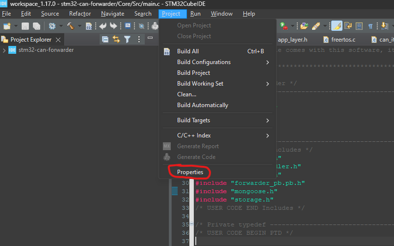
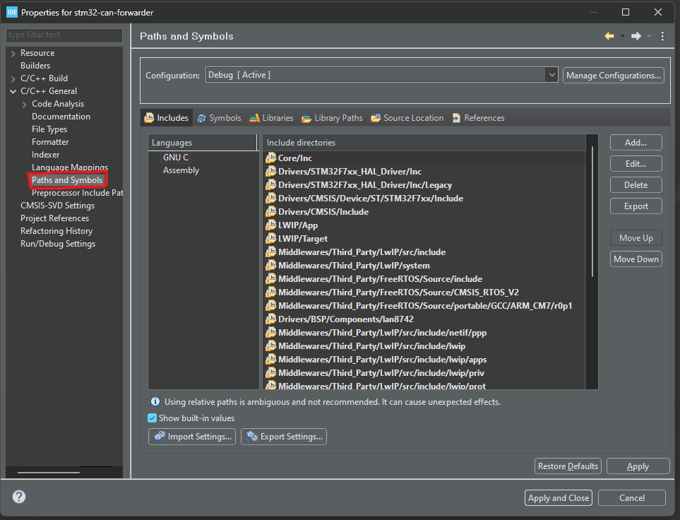
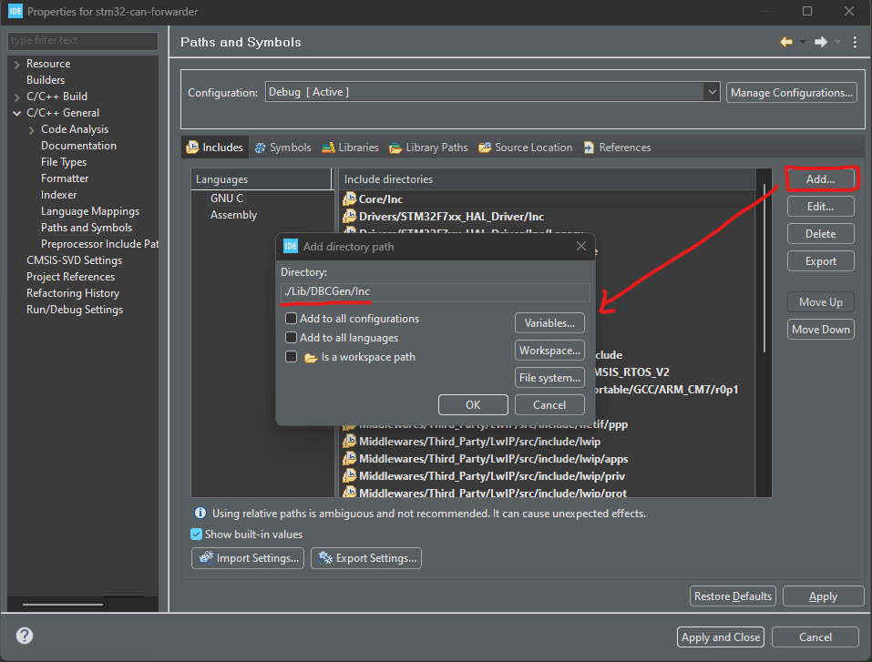
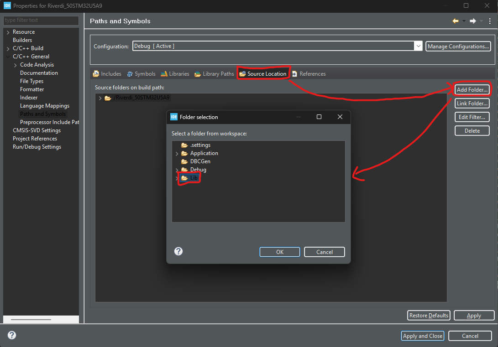
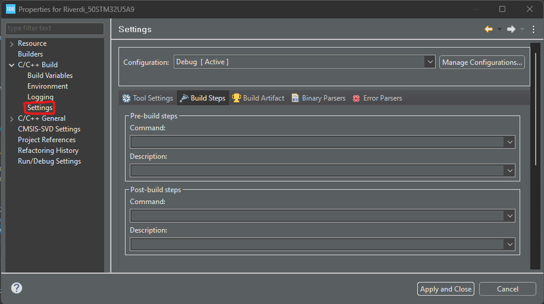
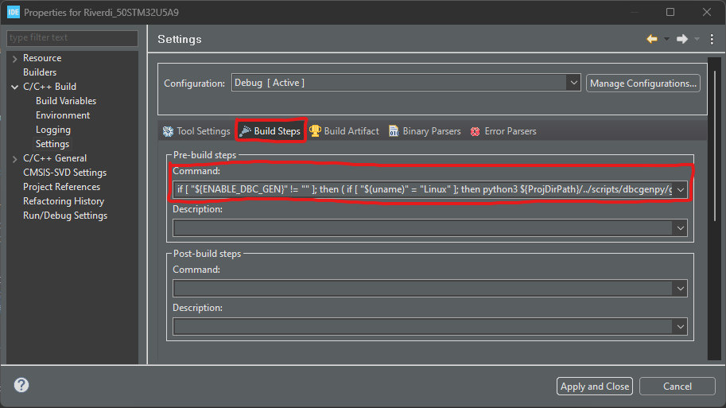
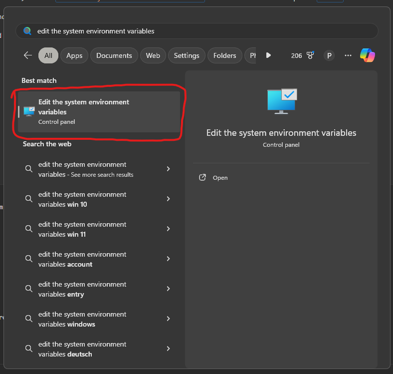
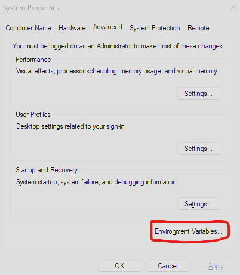
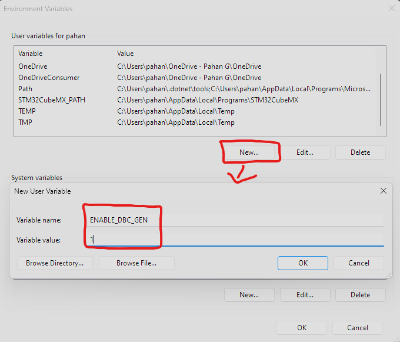
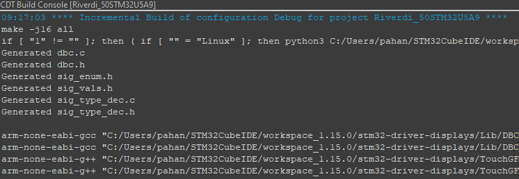

# dbcGenPy

This repo contains scripts that take `.dbc` files and generate c code that allow for easy encoding and decoding of CAN data. The `dbc-files` repo has already been included in this repo.


# Adding dbcGenPy to your Repo

This will cover adding dbcGenPy specifically to an STM32CubeIDE project.

## Adding dbcGenPy as a git Submodule

We will add this repo as a submodule to you repo. To do this, we first create a folder called `script` in the root directory of the project. Then *make sure you are inside the `script` folder*, and run:
`git submodule add git@bitbucket.org:redbackracing/dbcgenpy.git`

Then, change directory back to the project root folder, and run:
`git submodule update --init --recursive`

Now you should have the following folder structure
```
stm32-project-root-folder/ 
	scripts/
		dbcgenpy/
			dbc-files/
			files/
			gen/
```


## Configuring dbcGenPy 

dbcGenPy requires a `.config` file in the project root folder. A template for the `.config` file is provided as:
`scripts/dbcgenpy/.config.example`. Copy this file to the project root folder and rename it to `.config`. 
You should also check that `.config` isn't `.gitignored` by your repo.

The `.config` file will look like the following:
```
[GEN]
USE_SIGFLOAT=True
SIGFLOAT_TYPE=double
FLOAT_LITERAL_PREC=6

[OPTIONS]
GENERATE_PACK=True
GENERATE_UNPACK=True
GENERATE_SIGNAL_UNITS=False
GENERATE_SIGNAL_ENUMS=False
GENERATE_SIGNAL_VALS=False
GENERATE_SIGNAL_TYPE_DECODE=False

[DBC_FILES]
DBC_DIRS=
    # Control/ControlBus.dbc
    Sensor/SensorBus.dbc
    # Tractive/TractiveBus.dbc

[FILE_DIRS]
SOURCE_OUT_DIR=./Lib/DBCGen/Src
HEADER_OUT_DIR=./Lib/DBCGen/Inc
DBC_FILE_DIR=./scripts/dbcgenpy/dbc-files
```
For starting off, these settings should be good enough.

The function of each setting is:
- `USE_SIGFLOAT`: If true, the Pack and Unpack functions will automatically apply scaling/ offset. If false, the scaling/ offset will *not* be applied. You can apply it apply manually using separate signal encoding and decoding functions.

- `SIGFLOAT_TYPE`: The datatype of floats when `USE_SIGFLOAT=true`. Only real options are `float` and `double`.

- `FLOAT_LITERAL_PREC`: The number of decimal points given to the literals representing the scaling/ offset values.

- `GENERATE_PACK`: If true will generate the can frame pack functions in `dbc.c`.

- `GENERATE_UNPACK`: If true will generate the can frame unpack functions in `dbc.c`.

- `GENERATE_SIGNAL_UNITS`: If true will generate `#define` macros for the unit of every can signal in `sig_units.h`.

- `GENERATE_SIGNAL_ENUMS`: If true will generate an `enum` for every signal in `sig_enum.h`.

- `GENERATE_SIGNAL_VALS`: If true will generate `#define` macros for the values of signals in `sig_vals.h`.

- `GENERATE_SIGNAL_TYPE_DECODE`: If true will generate functions for applying/ un-applying scale/ offsets to signals in `sig_type_dec.c`.

- `DBC_DIRS`: List of the different `.dbc` files to look for. Uncomment/ comment according to the required `.dbc` files.

- `SOURCE_OUT_DIR`, `HEADER_OUT_DIR`, `DBC_FILE_DIR`: Paths to different files. Shouldn't need changing.


## Setting up STM32CubeIDE

You need to let STM32CubeIDE know about the new code generated by dbcGenPy. You can do this by going to `Project->Properties` 




then under `C/C++ General->Paths and Symbols`




then under `Includes` press `Add` then type `./Lib/DBCGen/Inc` and press `Ok`.




then, under the same `Paths and Symbols` tab, go to `Source Location`, press `Add Folder` and select the `Lib` folder and press `Ok`.



## Generating code with dbcGenPy

First, you need python and some dependancies installed. To do this, you can simply run `scripts/dbcgenpy/setup.bat` for windows or `scripts/dbcgenpy/setup.sh` for linux.

To start generating code, you need to setup STM32CubeIDE to run the script when it builds. To do this, go to `Project->Properties`


then under `C/C++ Build->Settings`




then under `Build Steps` paste the following code into the `Pre-build steps` `Command` box:
```
if [ "${ENABLE_DBC_GEN}" != "" ]; then ( if [ "$(uname)" = "Linux" ]; then python3 ${ProjDirPath}/../scripts/dbcgenpy/generate.py ${ProjDirPath}; else python ${ProjDirPath}/../scripts/dbcgenpy/generate.py ${ProjDirPath}; fi ); fi
```




This is setup such that code will only be generated if you have an env variable `ENABLE_DBC_GEN`. This prevents other people from requiring to go through setting up python etc, when they want to use this repo. 

To add `ENABLE_DBC_GEN` as ane env variable on windows, search `Edit the system environment variables` in the search bar and press `Enter`.




Then, press the `Environment Variables` button and bottom.




Then, press `New` and fill out as shown below and then press `Ok`.




Now, building on STM32CubeIDE should run dbcGenPy, and you should see something like this in the build console:




# Cloning a Repo with dbcGenPy

If you are just cloning a repo that already has dbcGenPy implemented, all you need to do is:

- Run `git submodule update --init --recursive` in the project root directory.
- Add `ENABLE_DBC_GEN` to you env variables (if you want to generate dbc code).
- Run `scripts/dbcgenpy/setup.bat` if you don't have python setup already (and if you want to generate dbc code).